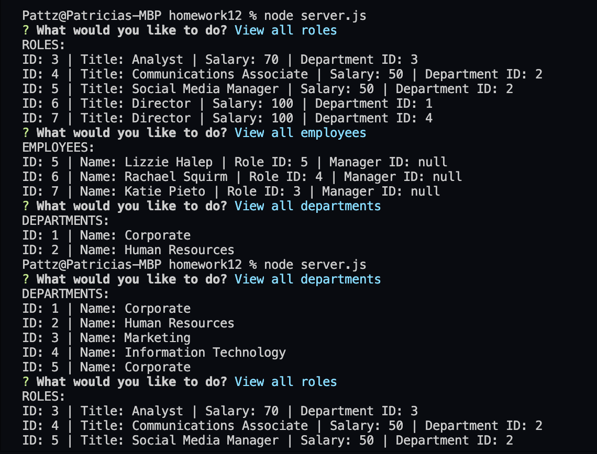
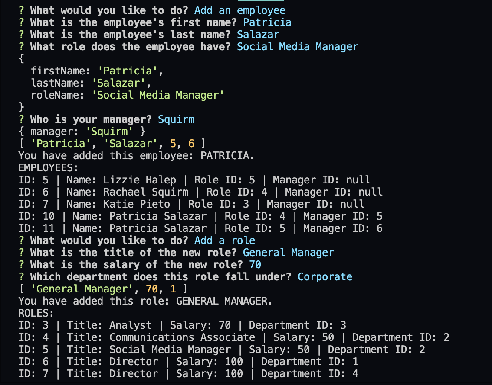

# Unit 12 MySQL Homework: Employee Tracker

Developers are often tasked with creating interfaces that make it easy for non-developers to view and interact with information stored in databases. Often these interfaces are known as **C**ontent **M**anagement **S**ystems. In this homework assignment, your challenge is to architect and build a solution for managing a company's employees using node, inquirer, and MySQL.

## Node MySql Employee Database 

This is a command line application that uses `node`, `express`, and `MySQL` to allow a user to see and update a MySQL database. 

### Starting the app locally

Start by installing front and backend dependencies. While in this directory, run the following command:

```
npm install
```

After both installations complete, run the following command in your terminal:

```
node server
```

Your app should now be running on <http://localhost:3306>. The Express server should intercept any AJAX requests from the client.

### Screenshots




### Video


